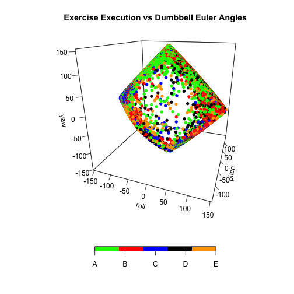
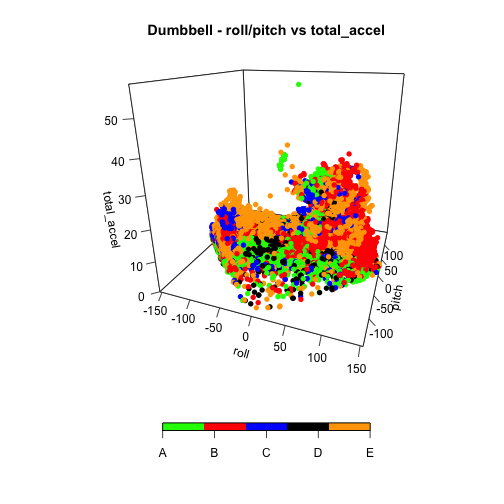
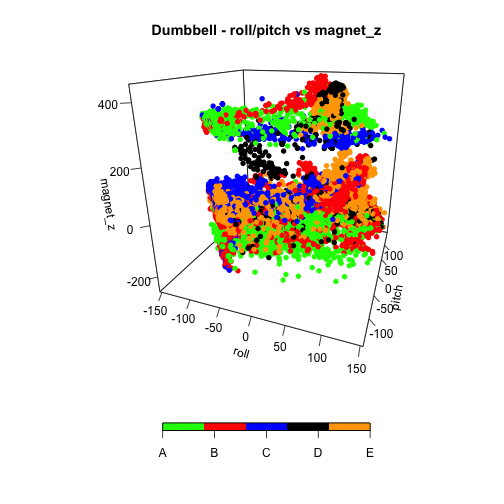
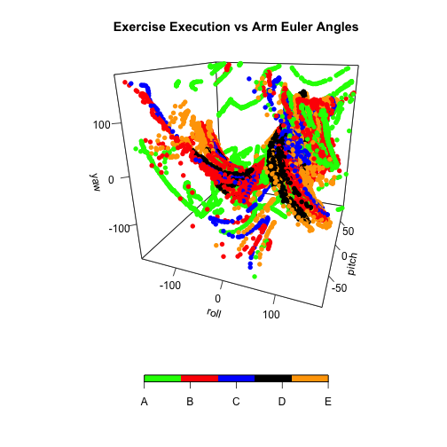
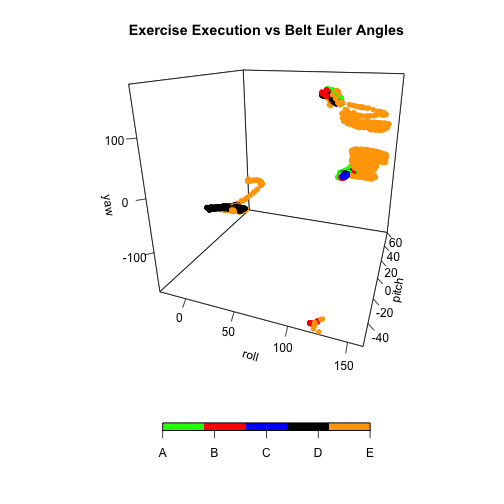
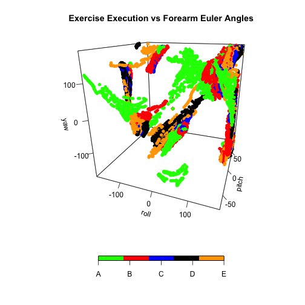

#Abstract
The following analysis is based in a research conducted by a groupd of academics interested in [Human Activity Recognition (HAR)](http://groupware.les.inf.puc-rio.br/har). The idea is based in that nowadays people is interested in quantify how *much* of a particular activity they do, but they rarely quantify *how well* they do it. The dataset was taken from the research group's website. The training dataset has more than 19 thousand observations of 6 males doing a weight lifting exercise. On each observation the outcome variable (named **classe** in the dataset) has one of five possible values (A, B, C, D, E) in which A corresponds to the exercise done correctly and B to E correspond to four typical mistakes people do when perform the exercise. Each individual performing the exercise was wearing four sensors, each of them installed in the dumbbell, the belt, the arm and the forearm. These sensors provides measurements of the Euler Angles (the spacial position of the sensor), the accelerometer, the gyroscope and the magnet.

The objective of this analysis is to **train a model** that is able to predict if an especific repetition of the weight lifting exercise was done correctly or not specifying the outcomes (A,B,C,D,E). The predictors are all the measurements of euler angles, gyroscope, accelerometer and magnet provided by the body sensors.

A **Random Forrest model** was trained using parallel processing and a 99.24% accuracy was obtained.

#Getting and Cleaning Data

The data for this project come from this source: http://groupware.les.inf.puc-rio.br/har

```r
url_training <- "https://d396qusza40orc.cloudfront.net/predmachlearn/pml-training.csv"
url_testing <- "https://d396qusza40orc.cloudfront.net/predmachlearn/pml-testing.csv"
if(!file.exists("./data")) dir.create("./data")
file_training <- "./data/pml-training.csv"
file_testing <- "./data/pml-testing.csv"
if(!file.exists(file_training))
        download.file(url_training,destfile=file_training,method="curl")
if(!file.exists(file_testing))
        download.file(url_testing,destfile=file_testing,method="curl")
training <- read.csv(file_training)
testing <- read.csv(file_testing)
```

##Cleaning the data
From the summary of the training dataset it can be identify the following issues with the data:

1) The **kurtosis** (kurtosis_roll_XXX, kurtosis_picth_XXX, kurtosis_yaw_XXX variables) were render as factor variables. In order to facilitate the analysis, these variables will be converted to continous numeric variables.
2) The **skewness** (skewness_roll_XXX, skewness_picth_XXX, skewness_yaw_XXX variables) are also factors variables and will be converted to numeric variables.
3) The variable **skewness_roll_belt.1** will be dropped. The variable **skewness_roll_belt** will be used in its place.
4) There are a group of variables that have 19216 NAs out of 19622 observations. Those variables will not add valuable information to train the prediction model; therefore, those variables will be eliminated from the analysis.
5) The variables **max_yaw** and **min_yaw** (max_yaw_XXX and min_yaw_XXX variables) were also rendered as factor variables. Those will be converted to numeric continous variables.
6) As max and min roll and picth variables have most of the values as NAs, the **amplitude** variables have also most of the values in NAs, so **amplitude** variables will be discarted from the analysis.
7) The variables max_yaw_XXX and min_yaw_XXX has the same values, as a result the variable amplitude_yaw_XX is always zero. So, these variables do not add information and will be discarted from the analysis.
8) As the machine learning algorithm will be trained to predict if the exercise was done well, the variables related to timestamp, window and the name of the person executing the exercise are irrelevant. Those variables will be dropped.

The following code chunk deals with the cleaning of the data following the previous 8 remarks about the dataset:


```r
#eliminating columns with more than 80% of the values in NAs
training <- training[,!colSums(is.na(training))>0.8*nrow(training)]
#transforming to numeric the kurtosis variables
training[,grep("kurtosis",names(training))] <- lapply(training[,grep("kurtosis",names(training))],as.numeric)
#transforming to numeric the skewness variables
training[,grep("skewness",names(training))] <- lapply(training[,grep("skewness",names(training))],as.numeric)
#eliminating the column "skewness_roll_belt.1""
training <- training[,names(training)!="skewness_roll_belt.1"]
#eliminating the variables max_yaw_XXX, min_yaw_XXX, amplitude_yaw_XXX
training <- training[,-grep("max_yaw",names(training))]
training <- training[,-grep("min_yaw",names(training))]
training <- training[,-grep("amplitude_yaw",names(training))]
#eliminating irrelevant variables for the analysis
training <- training[,names(training)!="user_name"]
training <- training[,-grep("timestamp",names(training))]
training <- training[,-grep("window",names(training))]
training <- training[,-1]
dim(training)
```

```
## [1] 19622    76
```

#Exploratory Data Analysis
The sensors that the individuals in the experiment were wearing provide the following measurements: the euler angles (roll, pitch and yaw) at each step of the sliding window and the raw accelerometer, gyroscope and magnetometer readings. One can expect that the likelihood that a weight lifting exercise is being executed correctly or incorrectly will depend highly in the position of the dumbbell at each time, then the euler angles for the dumbbell should be very important predictors in this experiment.

Following this reasoning, let's explore some plots of the relationshipt of the euler angles in the dumbbell and the outcome of the exercises:


```r
library(ggplot2)
library(plot3D)

par(mar=c(5.1,4.1,4.1,2.1))
x <- training$roll_dumbbell
y <- training$pitch_dumbbell
z <- training$yaw_dumbbell
scatter3D(x,y,z,colvar=as.integer(training$classe),col=c("green","red","blue","black","orange"),pch=16,cex=1,clim=c(1,5),ticktype="detailed",phi=20,theta=20,xlab="roll",ylab="pitch",zlab="yaw",main="Exercise Execution vs Dumbbell Euler Angles",colkey = list(at = c(1,2,3,4,5),side = 1,addlines=FALSE,length=0.5,width=0.5,labels=c("A","B","C","D","E")))
```

 

It can be observed in the previous plot that the yaw angle in the dumbbell differences the correct and incorrect execution of the exercise.

Also, differentiation can be observed if we change the z variable for other measurements like the total accelerometer of the dumbbell, and plot it against the dumbbell's roll and pitch angle:


```r
# Let's change z to be the total_accel_dumbbell variable
z <- training$total_accel_dumbbell
scatter3D(x,y,z,colvar=as.integer(training$classe),col=c("green","red","blue","black","orange"),pch=16,cex=1,clim=c(1,5),ticktype="detailed",phi=20,theta=20,xlab="roll",ylab="pitch",zlab="total_accel",main="Dumbbell - roll/pitch vs total_accel",colkey = list(at = c(1,2,3,4,5),side = 1,addlines=FALSE,length=0.5,width=0.5,labels=c("A","B","C","D","E")))
```

 

As with the last plot, separation can be appreciated changing the variable z by the dumbbell magnet_z:


```r
# Let's change z to be the total_accel_dumbbell variable
z <- training$magnet_dumbbell_z
scatter3D(x,y,z,colvar=as.integer(training$classe),col=c("green","red","blue","black","orange"),pch=16,cex=1,clim=c(1,5),ticktype="detailed",phi=20,theta=20,xlab="roll",ylab="pitch",zlab="magnet_z",main="Dumbbell - roll/pitch vs magnet_z",colkey = list(at = c(1,2,3,4,5),side = 1,addlines=FALSE,length=0.5,width=0.5,labels=c("A","B","C","D","E")))
```

 

It is intuitive to assume that the Euler Angles in the other sensors (arm, forearm and belt) will also predict some separation in the outcome of the exercise. The following plot shows the Euler Angles vs the Outcome in the arm sensor:


```r
library(ggplot2)
library(plot3D)

par(mar=c(5.1,4.1,4.1,2.1))
x <- training$roll_arm
y <- training$pitch_arm
z <- training$yaw_arm
scatter3D(x,y,z,colvar=as.integer(training$classe),col=c("green","red","blue","black","orange"),pch=16,cex=1,clim=c(1,5),ticktype="detailed",phi=20,theta=20,xlab="roll",ylab="pitch",zlab="yaw",main="Exercise Execution vs Arm Euler Angles",colkey = list(at = c(1,2,3,4,5),side = 1,addlines=FALSE,length=0.5,width=0.5,labels=c("A","B","C","D","E")))
```

 

The following plot shows the angles in the Belt Sensor:


```r
library(ggplot2)
library(plot3D)

par(mar=c(5.1,4.1,4.1,2.1))
x <- training$roll_belt
y <- training$pitch_belt
z <- training$yaw_belt
scatter3D(x,y,z,colvar=as.integer(training$classe),col=c("green","red","blue","black","orange"),pch=16,cex=1,clim=c(1,5),ticktype="detailed",phi=20,theta=20,xlab="roll",ylab="pitch",zlab="yaw",main="Exercise Execution vs Belt Euler Angles",colkey = list(at = c(1,2,3,4,5),side = 1,addlines=FALSE,length=0.5,width=0.5,labels=c("A","B","C","D","E")))
```

 

And finally the following plot shows the angles in the forearm sensor:


```r
library(ggplot2)
library(plot3D)

par(mar=c(5.1,4.1,4.1,2.1))
x <- training$roll_forearm
y <- training$pitch_forearm
z <- training$yaw_forearm
scatter3D(x,y,z,colvar=as.integer(training$classe),col=c("green","red","blue","black","orange"),pch=16,cex=1,clim=c(1,5),ticktype="detailed",phi=20,theta=20,xlab="roll",ylab="pitch",zlab="yaw",main="Exercise Execution vs Forearm Euler Angles",colkey = list(at = c(1,2,3,4,5),side = 1,addlines=FALSE,length=0.5,width=0.5,labels=c("A","B","C","D","E")))
```

 

As a conclusion from the Exploratory Data Analysis, it can be appreciated that the Euler Angles show separation in all the sensors, and specially in the Dumbbell sensor. Also, when an additional variable related to the magnet or the accelerometer is added to the plot separation is apparent as well.

#Predictors Selection

From the Exploratory Data Analysis, it can be inferred that all the sensors measurements related to Euler Angles, gyroscope, magnet and accelerometer will be important as predictors of the outcome of the exercise execution.

However, even after the Data Cleaning, 75 variables still remain in the training dataset.

**The correlation between the variables** was used as the method to reduce the amount of variables (75) to a smaller group that still explains most of the variance in the outcome. As a threshold, the new smaller groupd of variable is conformed by variables that has less than 75% of correlation between all of them. The following code chunk uses the functions **cor()** to build a **correlation matrix** between the variables and **findCorrelation()** from the caret packages to find which variables will exceed this threshold of 75% correlation with the other variables and therefore must be dropped from the analysis:


```r
predictors <- training[,-76]
names(predictors)
```

```
##  [1] "roll_belt"               "pitch_belt"             
##  [3] "yaw_belt"                "total_accel_belt"       
##  [5] "kurtosis_roll_belt"      "kurtosis_picth_belt"    
##  [7] "kurtosis_yaw_belt"       "skewness_roll_belt"     
##  [9] "skewness_yaw_belt"       "gyros_belt_x"           
## [11] "gyros_belt_y"            "gyros_belt_z"           
## [13] "accel_belt_x"            "accel_belt_y"           
## [15] "accel_belt_z"            "magnet_belt_x"          
## [17] "magnet_belt_y"           "magnet_belt_z"          
## [19] "roll_arm"                "pitch_arm"              
## [21] "yaw_arm"                 "total_accel_arm"        
## [23] "gyros_arm_x"             "gyros_arm_y"            
## [25] "gyros_arm_z"             "accel_arm_x"            
## [27] "accel_arm_y"             "accel_arm_z"            
## [29] "magnet_arm_x"            "magnet_arm_y"           
## [31] "magnet_arm_z"            "kurtosis_roll_arm"      
## [33] "kurtosis_picth_arm"      "kurtosis_yaw_arm"       
## [35] "skewness_roll_arm"       "skewness_pitch_arm"     
## [37] "skewness_yaw_arm"        "roll_dumbbell"          
## [39] "pitch_dumbbell"          "yaw_dumbbell"           
## [41] "kurtosis_roll_dumbbell"  "kurtosis_picth_dumbbell"
## [43] "kurtosis_yaw_dumbbell"   "skewness_roll_dumbbell" 
## [45] "skewness_pitch_dumbbell" "skewness_yaw_dumbbell"  
## [47] "total_accel_dumbbell"    "gyros_dumbbell_x"       
## [49] "gyros_dumbbell_y"        "gyros_dumbbell_z"       
## [51] "accel_dumbbell_x"        "accel_dumbbell_y"       
## [53] "accel_dumbbell_z"        "magnet_dumbbell_x"      
## [55] "magnet_dumbbell_y"       "magnet_dumbbell_z"      
## [57] "roll_forearm"            "pitch_forearm"          
## [59] "yaw_forearm"             "kurtosis_roll_forearm"  
## [61] "kurtosis_picth_forearm"  "kurtosis_yaw_forearm"   
## [63] "skewness_roll_forearm"   "skewness_pitch_forearm" 
## [65] "skewness_yaw_forearm"    "total_accel_forearm"    
## [67] "gyros_forearm_x"         "gyros_forearm_y"        
## [69] "gyros_forearm_z"         "accel_forearm_x"        
## [71] "accel_forearm_y"         "accel_forearm_z"        
## [73] "magnet_forearm_x"        "magnet_forearm_y"       
## [75] "magnet_forearm_z"
```

```r
correlation_matrix <- cor(predictors)
high_correlation <- findCorrelation(correlation_matrix,cutoff=0.75)
#now, let's eliminate the predictors with correlations higher than .75
predictors <- predictors[,-high_correlation]
names(predictors)
```

```
##  [1] "yaw_belt"               "gyros_belt_x"          
##  [3] "gyros_belt_y"           "gyros_belt_z"          
##  [5] "magnet_belt_x"          "magnet_belt_y"         
##  [7] "roll_arm"               "pitch_arm"             
##  [9] "yaw_arm"                "total_accel_arm"       
## [11] "gyros_arm_y"            "gyros_arm_z"           
## [13] "accel_arm_y"            "magnet_arm_x"          
## [15] "magnet_arm_z"           "roll_dumbbell"         
## [17] "pitch_dumbbell"         "yaw_dumbbell"          
## [19] "kurtosis_roll_dumbbell" "total_accel_dumbbell"  
## [21] "gyros_dumbbell_y"       "magnet_dumbbell_z"     
## [23] "roll_forearm"           "pitch_forearm"         
## [25] "yaw_forearm"            "skewness_roll_forearm" 
## [27] "total_accel_forearm"    "gyros_forearm_x"       
## [29] "gyros_forearm_z"        "accel_forearm_x"       
## [31] "accel_forearm_z"        "magnet_forearm_x"      
## [33] "magnet_forearm_y"       "magnet_forearm_z"
```

Regarding the Euler Angles, the variables correlation algorithm eliminates the roll and pitch angle from the belt sensor and leave the yaw angle. For the dumbbell, arm and forearm the algorithm leaves all the angles. This is in line with the observations done in the Exploratory Data Analysis. Also, the measurements from the gyroscope, accelerometer and magnet that explain the most variance in the outcome were left in the predictors group.

#Training the Model

The model selected for this analysis was **Random Forrest (RF)**. This algorithm is highly accurate for classifications problems. However it is also highly computational demanding, and it can takes hours running in a regular personal computer.

##Parallel Processing Setup
In order to make the RF algorithm more efficient, a parallel setup was used. The computer in which this analysis was run has the following characteristics:
- A macbook air
- 1.3 GHz Inte Core i5 with 4 Cores
- 4 GB of RAM
- OS X Version 10.9.5

The following code chunk configures the parallels processing in 3 of the 4 cores that the computer has:


```r
library(parallel)
library(doParallel)
cluster <- makeCluster(detectCores() - 1)
registerDoParallel(cluster)
```

##Cross-Validation

For cross-validation, a **k-fold** algorithm with k = 10 will be used. In the caret package, the cross-validation is configured in the **trainControl** object:


```r
fitControl <- trainControl(method="cv",number=10,allowParallel=TRUE)
```

The **allowParallel** parameter tells the caret's train() function to use the parallel processing.

##Model training using parallel processing

The following code chunk deals with the model training using **caret package random forrest** and parallel processing:


```r
mytraining <- training
mytraining <- predictors
mytraining$y <- training$classe
set.seed(12748)
system.time(modFit <- train(y ~.,data=mytraining,method="rf",trControl=fitControl))
```

```
##     user   system  elapsed 
##   53.371    3.952 1110.107
```

```r
print(modFit)
```

```
## Random Forest 
## 
## 19622 samples
##    34 predictor
##     5 classes: 'A', 'B', 'C', 'D', 'E' 
## 
## No pre-processing
## Resampling: Cross-Validated (10 fold) 
## Summary of sample sizes: 17660, 17660, 17660, 17660, 17660, 17659, ... 
## Resampling results across tuning parameters:
## 
##   mtry  Accuracy   Kappa      Accuracy SD  Kappa SD   
##    2    0.9940372  0.9924572  0.001576461  0.001994459
##   18    0.9928651  0.9909746  0.001441737  0.001824320
##   34    0.9828764  0.9783398  0.001969626  0.002490642
## 
## Accuracy was used to select the optimal model using  the largest value.
## The final value used for the model was mtry = 2.
```

```r
modFit$finalModel
```

```
## 
## Call:
##  randomForest(x = x, y = y, mtry = param$mtry) 
##                Type of random forest: classification
##                      Number of trees: 500
## No. of variables tried at each split: 2
## 
##         OOB estimate of  error rate: 0.58%
## Confusion matrix:
##      A    B    C    D    E  class.error
## A 5577    2    0    0    1 0.0005376344
## B   14 3776    7    0    0 0.0055306821
## C    0   23 3388   11    0 0.0099357101
## D    0    0   46 3165    5 0.0158582090
## E    0    0    0    5 3602 0.0013861935
```

#Prediction in the Testing Dataset

The testing dataset has 20 observations, the following code chunk uses the model fitted in order to predict the outcome for those 20 observations:


```r
fix_na <- function(x){
        for(i in 1:ncol(x)){
                if(sum(is.na(x[,i]))>0) x[,i][is.na(x[,i])] <- 0
        }
        x
}

testing[,grep("kurtosis",names(testing))] <- lapply(testing[,grep("kurtosis",names(testing))],as.numeric)
#transforming to numeric the skewness variables
testing[,grep("skewness",names(testing))] <- lapply(testing[,grep("skewness",names(testing))],as.numeric)
testing <- fix_na(testing)
predict(modFit,testing)
```

```
##  [1] B A B A A E D B A A B C B A E E A B B B
## Levels: A B C D E
```

The testing dataset has many variables with all values as NAs. Those NAs were replaced by zero with the helper function **fix_na()** defined in the previous code chunck. Also the *kurtosis* and *skewness* variables were converted from factor variable to numeric variables in order to match the transformation done in the training set.
